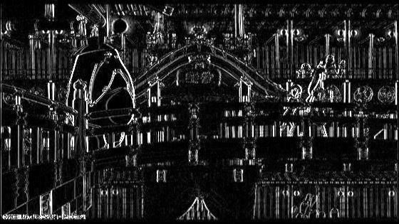
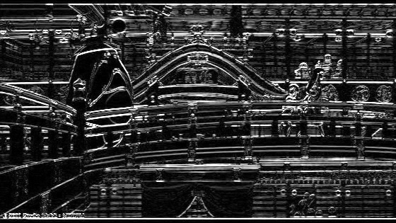
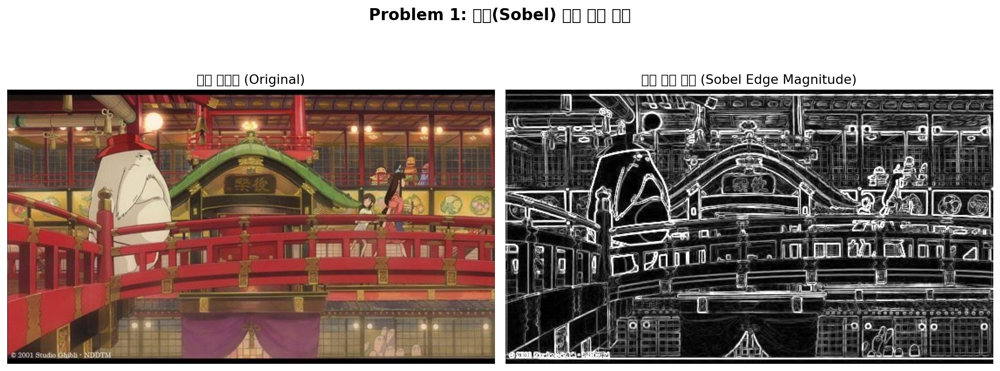

# Problem 1: 소벨(Sobel) 에지 검출 및 결과 시각화

 
> **주차**: L03 Edge and Region

---

## 1. 과제 설명 (Description)

### 문제 목표
`edgeDetectionImage.jpg` 이미지를 대상으로 소벨(Sobel) 필터를 사용하여 에지를 검출하고, 원본 이미지와 에지 강도 이미지를 나란히 시각화합니다.

### 핵심 요구사항
| 항목 | 사용 함수 | 세부 내용 |
|------|-----------|-----------|
| 이미지 불러오기 | `cv.imread()` | 이미지 파일을 BGR 형식으로 로드 |
| 그레이스케일 변환 | `cv.cvtColor()` | BGR → GRAY 채널 변환 |
| X축 에지 검출 | `cv.Sobel()` | `cv.CV_64F, dx=1, dy=0` |
| Y축 에지 검출 | `cv.Sobel()` | `cv.CV_64F, dx=0, dy=1` |
| 에지 강도 계산 | `cv.magnitude()` | √(Gx² + Gy²) 계산 |
| uint8 변환 | `cv.convertScaleAbs()` | float64 → uint8로 변환 |
| 시각화 | `matplotlib.pyplot` | 원본 + 에지 이미지 나란히 출력 |

---

## 2. 핵심 로직 설명 (Core Logic)

### 소벨(Sobel) 필터란?
소벨 필터는 **이미지의 1차 미분**을 이용하여 픽셀 강도의 급격한 변화(에지)를 검출하는 필터입니다.

```
X방향 소벨 커널 (수직 에지 검출):      Y방향 소벨 커널 (수평 에지 검출):
┌─────────────────┐                    ┌─────────────────┐
│  -1   0   +1   │                    │  -1  -2  -1   │
│  -2   0   +2   │                    │   0   0   0   │
│  -1   0   +1   │                    │  +1  +2  +1   │
└─────────────────┘                    └─────────────────┘
```

### 알고리즘 흐름
```
원본 이미지 (BGR)
    ↓  cv.cvtColor(COLOR_BGR2GRAY)
그레이스케일 이미지
    ↓  cv.Sobel(CV_64F, dx=1, dy=0, ksize=3)        ↓  cv.Sobel(CV_64F, dx=0, dy=1, ksize=3)
   Gx (X방향 그래디언트)                              Gy (Y방향 그래디언트)
         ↓  cv.magnitude(Gx, Gy)
   에지 강도 = √(Gx² + Gy²)
         ↓  cv.convertScaleAbs()
   uint8 에지 강도 이미지 → 시각화 및 저장
```

### 핵심 코드 설명
- **`cv.CV_64F`**: float64 출력 타입. 음수 에지(어두운→밝은 방향)도 정확히 저장하기 위해 필수
- **`ksize=3`**: 3×3 소벨 커널 사용. 5로도 가능하나 3이 더 선명한 에지 검출
- **`cv.magnitude()`**: Gx, Gy를 벡터 크기로 합산하여 전방향 에지 강도 표현
- **`cv.convertScaleAbs()`**: float64 값을 0~255 범위의 uint8로 정규화 및 변환

---

## 3. 환경 설정 및 터미널 실행 방법 (How to Run)

### 방법 A: Python venv 가상환경 (권장)

```bash
# 1. Problem_1 폴더로 이동
cd /home/ji/Desktop/homework/3week/Problem_1

# 2. 가상환경 생성 (Python 3.10 이상 권장)
python3 -m venv .venv

# 3. 가상환경 활성화 (Linux/Mac)
source .venv/bin/activate

# 4. 필요 패키지 설치
pip install -r requirements.txt

# 5. 코드 실행
python main.py

# 6. 작업 완료 후 가상환경 비활성화
deactivate
```

### 방법 B: Conda 가상환경

```bash
# 1. Conda 환경 생성 (Python 3.10)
conda create -n cv_homework python=3.10 -y

# 2. 환경 활성화
conda activate cv_homework

# 3. 필요 패키지 설치
pip install -r requirements.txt

# 4. Problem_1 폴더로 이동 후 실행
cd /home/ji/Desktop/homework/3week/Problem_1
python main.py

# 5. 환경 비활성화
conda deactivate
```

> **참고**: 이미 OpenCV와 Matplotlib이 설치된 환경이라면 가상환경 없이 바로 `python main.py`도 가능합니다.

---

## 4. 중간 결과 (Intermediate Results)

### 터미널 출력 로그 (예상)

```
[완료] 이미지 불러오기 성공: .../images/edgeDetectionImage.jpg
[정보] 이미지 크기: 500x375 (너비x높이), 채널: 3
[완료] 그레이스케일 변환 완료: 이미지 채널 수 -> 2
[완료] X축 방향 소벨 에지 검출 완료 (수직 에지)
[완료] Y축 방향 소벨 에지 검출 완료 (수평 에지)
[완료] 에지 강도 계산 완료 (최대값: 1423.17, 최소값: 0.00)
[완료] 에지 강도 이미지 uint8 변환 완료 (자료형: uint8)
[완료] 결과 이미지 저장 완료: .../results/
[완료] 시각화 결과 저장 완료: .../results/result_visualization.png
```

### 중간 결과 이미지 (X, Y 방향 에지)





---

## 5. 최종 결과 (Final Results)

### 최종 시각화 (원본 + 에지 강도 이미지)



### 결과 분석
- **밝은 픽셀**: 에지(경계선)가 강하게 검출된 부분 (그래디언트 크기 큼)
- **어두운 픽셀**: 평탄한 배경 영역 (그래디언트 크기 작음)
- X+Y 방향 에지의 크기(magnitude)를 합산하여 모든 방향의 에지를 검출

### 생성된 파일 목록
```
results/
├── sobel_x.jpg              # X방향 에지 (수직 경계선)
├── sobel_y.jpg              # Y방향 에지 (수평 경계선)
├── edge_magnitude.jpg       # 전체 에지 강도 이미지
└── result_visualization.png # 원본 + 에지 강도 나란히 시각화
```

---

## 6. 전체 코드 (Full Source Code)

```python
"""
=============================================================================
Problem 1: 소벨(Sobel) 에지 검출 및 결과 시각화
=============================================================================
"""
import cv2 as cv
import numpy as np
import matplotlib.pyplot as plt
import os

# 1단계: 이미지 불러오기
script_dir = os.path.dirname(os.path.abspath(__file__))
image_path = os.path.join(script_dir, "images", "edgeDetectionImage.jpg")
img_bgr = cv.imread(image_path)
if img_bgr is None:
    raise FileNotFoundError(f"이미지를 찾을 수 없습니다: {image_path}")
print(f"[완료] 이미지 불러오기 성공: {image_path}")

# 2단계: 그레이스케일 변환
img_gray = cv.cvtColor(img_bgr, cv.COLOR_BGR2GRAY)

# 3단계: 소벨 필터로 X, Y 방향 에지 검출
sobel_x = cv.Sobel(img_gray, cv.CV_64F, 1, 0, ksize=3)  # X축 에지
sobel_y = cv.Sobel(img_gray, cv.CV_64F, 0, 1, ksize=3)  # Y축 에지

# 4단계: 에지 강도(magnitude) 계산
edge_magnitude = cv.magnitude(sobel_x, sobel_y)

# 5단계: float64 -> uint8 변환
edge_uint8 = cv.convertScaleAbs(edge_magnitude)

# 6단계: 결과 저장
result_dir = os.path.join(script_dir, "results")
os.makedirs(result_dir, exist_ok=True)
cv.imwrite(os.path.join(result_dir, "edge_magnitude.jpg"), edge_uint8)

# 7단계: Matplotlib으로 시각화
img_rgb = cv.cvtColor(img_bgr, cv.COLOR_BGR2RGB)
fig, axes = plt.subplots(1, 2, figsize=(14, 6))
fig.suptitle("Problem 1: 소벨(Sobel) 에지 검출 결과", fontsize=16, fontweight='bold')
axes[0].imshow(img_rgb)
axes[0].set_title("원본 이미지 (Original)", fontsize=13)
axes[0].axis('off')
axes[1].imshow(edge_uint8, cmap='gray')
axes[1].set_title("소벨 에지 강도 (Sobel Edge Magnitude)", fontsize=13)
axes[1].axis('off')
plt.tight_layout()
plt.savefig(os.path.join(result_dir, "result_visualization.png"), dpi=150, bbox_inches='tight')
plt.show()
```

> 전체 주석 포함 코드는 [`main.py`](main.py) 파일을 참고하세요.
