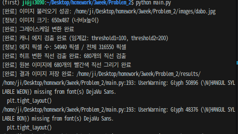
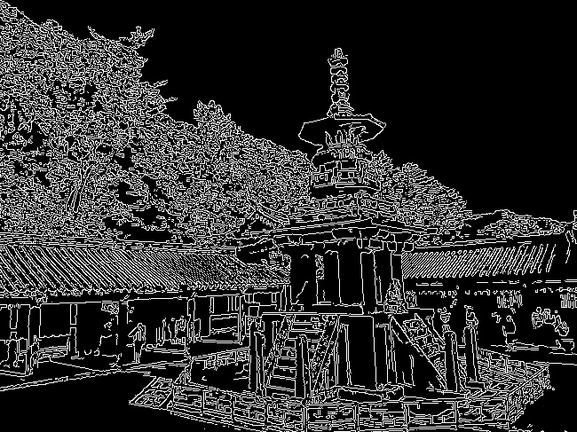
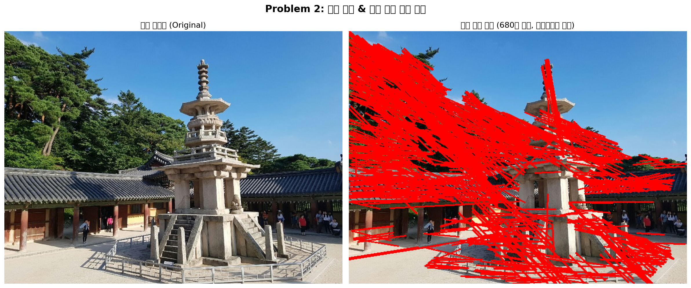

# Problem 2: 캐니(Canny) 에지 및 허프(Hough) 변환을 이용한 직선 검출

>
> **주차**: L03 Edge and Region

---

## 1. 과제 설명 (Description)

### 문제 목표
`dabo.jpg` 이미지에 캐니(Canny) 에지 검출을 적용하여 에지 맵을 생성하고, 허프 변환(HoughLinesP)을 사용하여 이미지 내 직선을 검출한 후 원본 이미지에 **빨간색**으로 표시합니다.

### 핵심 요구사항
| 항목 | 사용 함수 | 세부 내용 |
|------|-----------|-----------|
| 에지 맵 생성 | `cv.Canny()` | threshold1=100, threshold2=200 |
| 직선 검출 | `cv.HoughLinesP()` | rho, theta, threshold, minLineLength, maxLineGap 조정 |
| 직선 그리기 | `cv.line()` | 색상=(0,0,255), 두께=2 |
| 시각화 | `matplotlib.pyplot` | 원본 + 직선 이미지 나란히 출력 |

---

## 2. 핵심 로직 설명 (Core Logic)

### 캐니(Canny) 에지 검출 알고리즘
캐니 에지 검출은 **4단계 파이프라인**으로 동작합니다:

```
1. 가우시안 블러   → 노이즈 제거
2. 소벨 필터      → 그래디언트 크기 및 방향 계산
3. 비최대 억제    → 에지 선을 1픽셀 두께로 얇게 만들기
4. 이중 임계값    → 강한 에지 확정, 약한 에지는 연결 여부로 판단
```

### 허프 확률적 변환(HoughLinesP) 원리
```
에지 이미지의 각 피겔 → 허프 공간(rho-theta)에 투표
투표 수가 threshold 이상인 직선 → 직선으로 검출
두 끝점 좌표(x1,y1,x2,y2) 형태로 반환
```

### 핵심 파라미터
| 파라미터 | 값 | 설명 |
|----------|----|------|
| `threshold1` | 100 | 캐니 하위 임계값 (이하: 에지 제외) |
| `threshold2` | 200 | 캐니 상위 임계값 (이상: 강한 에지) |
| `rho` | 1 | 허프 공간 거리 해상도 (픽셀) |
| `theta` | π/180 | 허프 공간 각도 해상도 (1도) |
| `threshold` | 80 | 직선 판정 최소 투표 수 |
| `minLineLength` | 50 | 검출할 최소 직선 길이 |
| `maxLineGap` | 10 | 선분 연결 허용 최대 간격 |

### 알고리즘 흐름
```
원본 이미지 (BGR)
    ↓  cv.cvtColor(COLOR_BGR2GRAY)
그레이스케일 이미지
    ↓  cv.Canny(threshold1=100, threshold2=200)
에지 맵 (이진 이미지: 에지=255, 배경=0)
    ↓  cv.HoughLinesP(rho=1, theta=π/180, threshold=80, ...)
검출된 직선 목록 [(x1,y1,x2,y2), ...]
    ↓  cv.line(color=(0,0,255), thickness=2)
원본 이미지 + 빨간색 직선 → 시각화 및 저장
```

---

## 3. 환경 설정 및 터미널 실행 방법 (How to Run)

### 방법 A: Python venv 가상환경 (권장)

```bash
# 1. Problem_2 폴더로 이동
cd /home/ji/Desktop/homework/3week/Problem_2

# 2. 가상환경 생성
python3 -m venv .venv

# 3. 가상환경 활성화 (Linux/Mac)
source .venv/bin/activate

# 4. 필요 패키지 설치
pip install -r requirements.txt

# 5. 코드 실행
python main.py

# 6. 작업 완료 후 가상환경 비활성화
deactivate
```

### 방법 B: Conda 가상환경

```bash
# 1. Conda 환경 생성 (기존 환경 재활용 가능)
conda create -n cv_homework python=3.10 -y
conda activate cv_homework

# 2. 패키지 설치
pip install -r requirements.txt

# 3. 이동 후 실행
cd /home/ji/Desktop/homework/3week/Problem_2
python main.py

# 4. 비활성화
conda deactivate
```

---

## 4. 중간 결과 (Intermediate Results)

### 터미널 출력 로그 


### 캐니 에지 맵 (중간 결과)



---

## 5. 최종 결과 (Final Results)

### 최종 시각화 (원본 + 직선 검출 결과)



### 결과 분석
- **빨간색 직선**: HoughLinesP로 검출된 직선 (threshold=80, minLineLength=50 기준)
- 건물의 수직/수평 선, 창문 틀, 지붕선 등 구조적 직선들이 검출됨
- 파라미터 조정으로 검출 정밀도 변화 가능 (threshold↑ → 더 긴 직선만 검출)

### 생성된 파일 목록
```
results/
├── canny_edges.jpg          # 캐니 에지 맵 (이진 이미지)
├── lines_detected.jpg       # 직선이 그려진 이미지
└── result_visualization.png # 원본 + 직선 검출 나란히 시각화
```

---

## 6. 전체 코드 (Full Source Code)

```python
"""
Problem 2: 캐니(Canny) 에지 및 허프(Hough) 변환을 이용한 직선 검출
"""
import cv2 as cv
import numpy as np
import matplotlib.pyplot as plt
import os

# 1단계: 이미지 불러오기
script_dir = os.path.dirname(os.path.abspath(__file__))
image_path = os.path.join(script_dir, "images", "dabo.jpg")
img_bgr = cv.imread(image_path)
if img_bgr is None:
    raise FileNotFoundError(f"이미지를 찾을 수 없습니다: {image_path}")

# 2단계: 그레이스케일 변환
img_gray = cv.cvtColor(img_bgr, cv.COLOR_BGR2GRAY)

# 3단계: 캐니 에지 검출
edges = cv.Canny(img_gray, threshold1=100, threshold2=200)

# 4단계: 허프 확률적 변환으로 직선 검출
lines = cv.HoughLinesP(
    edges,
    rho=1,
    theta=np.pi / 180,
    threshold=80,
    minLineLength=50,
    maxLineGap=10
)

# 5단계: 검출된 직선을 원본 이미지에 그리기
img_with_lines = img_bgr.copy()
for line in lines:
    x1, y1, x2, y2 = line[0]
    cv.line(img_with_lines, (x1, y1), (x2, y2), color=(0, 0, 255), thickness=2)

# 6단계: 결과 시각화
img_rgb = cv.cvtColor(img_bgr, cv.COLOR_BGR2RGB)
img_lines_rgb = cv.cvtColor(img_with_lines, cv.COLOR_BGR2RGB)
fig, axes = plt.subplots(1, 2, figsize=(16, 7))
axes[0].imshow(img_rgb)
axes[0].set_title("원본 이미지 (Original)", fontsize=13)
axes[0].axis('off')
axes[1].imshow(img_lines_rgb)
axes[1].set_title(f"직선 검출 결과 ({len(lines)}개 검출)", fontsize=13)
axes[1].axis('off')
plt.tight_layout()
plt.savefig("results/result_visualization.png", dpi=150, bbox_inches='tight')
plt.show()
```

> 전체 주석 포함 코드는 [`main.py`](main.py) 파일을 참고하세요.
