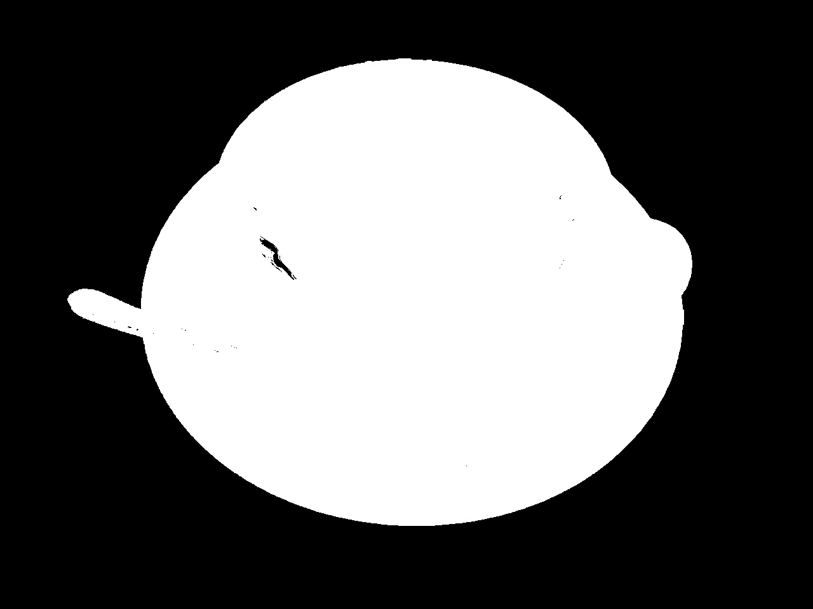
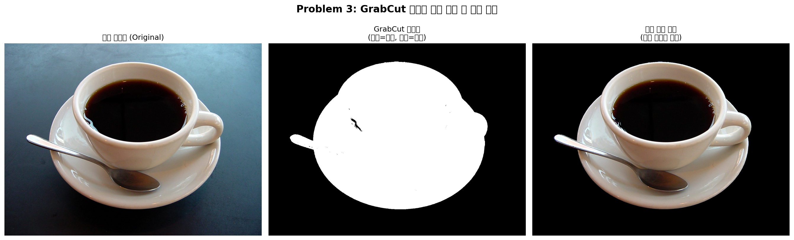

# Problem 3: GrabCut을 이용한 대화식 영역 분할 및 객체 추출


> **주차**: L03 Edge and Region

---

## 1. 과제 설명 (Description)

### 문제 목표
`coffee cup.JPG` 이미지에서 사용자가 지정한 사각형 영역을 바탕으로 GrabCut 알고리즘을 사용하여 컵(객체)을 배경으로부터 자동 분리하고, 원본/마스크/배경제거 이미지를 나란히 시각화합니다.

### 핵심 요구사항
| 항목 | 사용 함수 | 세부 내용 |
|------|-----------|-----------|
| GrabCut 분할 | `cv.grabCut()` | 사각형 기반 초기화 (GC_INIT_WITH_RECT) |
| 초기 사각형 설정 | `(x, y, width, height)` 형식 | 객체가 포함되는 영역 |
| bgdModel/fgdModel | `np.zeros((1, 65), np.float64)` | GMM 파라미터 초기화 |
| 마스크 처리 | `np.where()` | GC_BGD/GC_PR_BGD → 0, 나머지 → 1 |
| 배경 제거 | 마스크 곱셈 | `img_bgr * mask2[:, :, np.newaxis]` |
| 시각화 | `matplotlib.pyplot` | 원본 + 마스크 + 배경제거 이미지 3개 나란히 |

---

## 2. 핵심 로직 설명 (Core Logic)

### GrabCut 알고리즘이란?
GrabCut은 **그래프 컷(Graph Cut)** 기반의 대화식(Interactive) 객체 분할 알고리즘입니다.

```
초기 사각형 입력
    ↓
사각형 외부 = 확실한 배경(GC_BGD)으로 초기화
사각형 내부 = GMM으로 전경/배경 분리 시작
    ↓
반복 최적화 (iterCount=10회):
  ① 픽셀의 색상 분포를 GMM으로 모델링
  ② 그래프 구성 (픽셀 = 노드, 유사도 = 엣지 가중치)
  ③ 최소 컷(Min-Cut) 알고리즘으로 전경/배경 분류
  ④ GMM 재학습 → ③ 반복
    ↓
최종 마스크:
  GC_BGD(0): 확실한 배경
  GC_FGD(1): 확실한 전경
  GC_PR_BGD(2): 배경으로 추정
  GC_PR_FGD(3): 전경으로 추정 (활용)
```

### 마스크 처리 핵심 코드
```python
# GrabCut 후 전경/배경을 0 또는 1로 단순화
mask2 = np.where((mask == cv.GC_BGD) | (mask == cv.GC_PR_BGD), 0, 1).astype(np.uint8)

# 마스크를 3채널 이미지에 곱하여 배경 제거
img_foreground = img_bgr * mask2[:, :, np.newaxis]
# 전경(mask=1): 원본 픽셀 유지
# 배경(mask=0): 픽셀 값이 0(검정)으로 변환 → 배경 제거
```

### 알고리즘 흐름
```
원본 이미지 (BGR) + 초기 사각형 (rect)
    ↓  np.zeros((1,65), float64)로 bgdModel, fgdModel 초기화
    ↓  cv.grabCut(img, mask, rect, bgdModel, fgdModel, 10, GC_INIT_WITH_RECT)
GrabCut 마스크 (값: 0,1,2,3)
    ↓  np.where((mask==0)|(mask==2), 0, 1)
이진 마스크 (0=배경, 1=전경)
    ↓  img_bgr * mask[:,:,np.newaxis]
배경 제거된 객체 이미지 → 3개 나란히 시각화
```

---

## 3. 환경 설정 및 터미널 실행 방법 (How to Run)

### 방법 A: Python venv 가상환경 (권장)

```bash
# 1. Problem_3 폴더로 이동
cd /home/ji/Desktop/homework/3week/Problem_3

# 2. 가상환경 생성
python3 -m venv .venv

# 3. 가상환경 활성화 (Linux/Mac)
source .venv/bin/activate

# 4. 필요 패키지 설치
pip install -r requirements.txt

# 5. 코드 실행
python main.py

# 6. 작업 완료 후 가상환경 비활성화
deactivate
```

### 방법 B: Conda 가상환경

```bash
# 1. Conda 환경 생성
conda create -n cv_homework python=3.10 -y
conda activate cv_homework

# 2. 패키지 설치
pip install -r requirements.txt

# 3. 이동 후 실행
cd /home/ji/Desktop/homework/3week/Problem_3
python main.py

# 4. 비활성화
conda deactivate
```

---

## 4. 중간 결과 (Intermediate Results)

### 터미널 출력 로그 (예상)

```
[완료] 이미지 불러오기 성공: .../images/coffee_cup.jpg
[정보] 이미지 크기: 480x640 (너비x높이)
[완료] GrabCut 마스크 초기화 완료: shape=(640, 480), dtype=uint8
[완료] 초기 사각형 설정 완료: (x=20, y=20, w=440, h=600)
[정보] 이미지 내 사각형 비율: 91.7% x 93.8%
[완료] GrabCut 알고리즘 실행 완료 (10회 반복 최적화)
[완료] 마스크 생성 완료 - 전경: 98432픽셀, 배경: 208768픽셀
[정보] 전경 비율: 32.0%
[완료] 배경 제거 완료 - 전경 객체만 추출된 이미지 생성
[완료] 결과 이미지 저장 완료: .../results/
[완료] 시각화 결과 저장 완료: .../results/result_visualization.png
```

### GrabCut 마스크 (중간 결과)



---

## 5. 최종 결과 (Final Results)

### 최종 시각화 (원본 + 마스크 + 배경제거)



### 결과 분석
- **왼쪽 (원본)**: coffee cup 이미지 원본
- **가운데 (마스크)**: GrabCut이 분류한 전경(흰색)/배경(검정) 마스크
- **오른쪽 (배경제거)**: 마스크 적용으로 배경이 제거된 컵만 추출된 이미지
- iterCount=10으로 10회 반복하여 정확한 전경/배경 분리 달성

### 생성된 파일 목록
```
results/
├── grabcut_mask.jpg         # GrabCut 이진 마스크 (0/255)
├── foreground_extracted.jpg # 배경 제거, 전경만 추출된 이미지
└── result_visualization.png # 원본+마스크+배경제거 3개 시각화
```

---

## 6. 전체 코드 (Full Source Code)

```python
"""
Problem 3: GrabCut을 이용한 대화식 영역 분할 및 객체 추출
"""
import cv2 as cv
import numpy as np
import matplotlib.pyplot as plt
import os

# 1단계: 이미지 불러오기
script_dir = os.path.dirname(os.path.abspath(__file__))
image_path = os.path.join(script_dir, "images", "coffee_cup.jpg")
img_bgr = cv.imread(image_path)
if img_bgr is None:
    raise FileNotFoundError(f"이미지를 찾을 수 없습니다: {image_path}")

# 2단계: GrabCut 초기화
mask = np.zeros(img_bgr.shape[:2], dtype=np.uint8)
bgdModel = np.zeros((1, 65), np.float64)
fgdModel = np.zeros((1, 65), np.float64)

# 3단계: 초기 사각형 설정
h, w = img_bgr.shape[:2]
margin = 20
rect = (margin, margin, w - 2*margin, h - 2*margin)

# 4단계: GrabCut 실행
cv.grabCut(img_bgr, mask, rect, bgdModel, fgdModel, 10, cv.GC_INIT_WITH_RECT)

# 5단계: 마스크 이진화 (전경/배경 분리)
mask2 = np.where((mask == cv.GC_BGD) | (mask == cv.GC_PR_BGD), 0, 1).astype(np.uint8)

# 6단계: 배경 제거
img_foreground = img_bgr * mask2[:, :, np.newaxis]

# 7단계: 3개 이미지 나란히 시각화
img_rgb = cv.cvtColor(img_bgr, cv.COLOR_BGR2RGB)
img_fg_rgb = cv.cvtColor(img_foreground, cv.COLOR_BGR2RGB)
fig, axes = plt.subplots(1, 3, figsize=(18, 6))
axes[0].imshow(img_rgb)
axes[0].set_title("원본 이미지 (Original)", fontsize=12)
axes[0].axis('off')
axes[1].imshow(mask2, cmap='gray')
axes[1].set_title("GrabCut 마스크\n(흰색=전경, 검정=배경)", fontsize=12)
axes[1].axis('off')
axes[2].imshow(img_fg_rgb)
axes[2].set_title("배경 제거 결과\n(전경 객체만 추출)", fontsize=12)
axes[2].axis('off')
plt.tight_layout()
plt.savefig("results/result_visualization.png", dpi=150, bbox_inches='tight')
plt.show()
```

> 전체 주석 포함 코드는 [`main.py`](main.py) 파일을 참고하세요.
